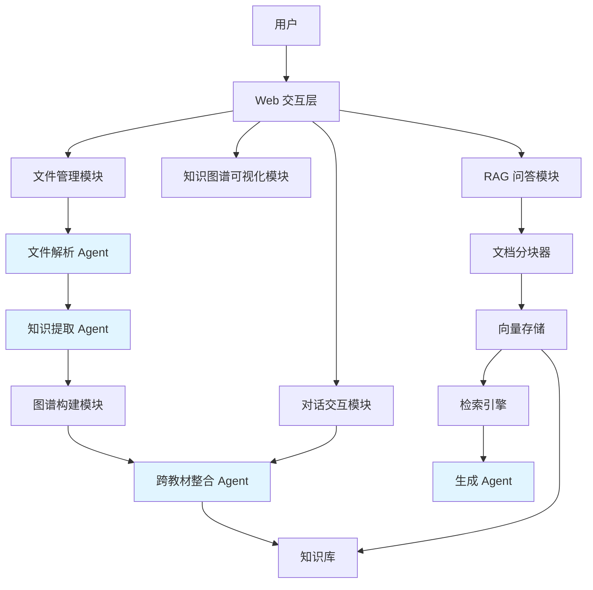
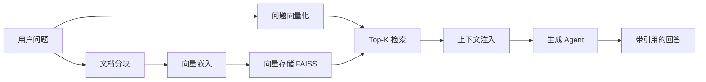

# 学科知识整合智能体 - Agent 架构说明

## 项目概述

本项目旨在构建一个多教材知识整合智能体系统，通过 AI 技术将多本同学科教材的冗余内容压缩至原始体量的 30% 以内，同时保证教学完整性。系统支持知识图谱构建、跨教材语义对齐、知识去重整合，并提供基于 RAG 的精准问答能力。

**核心目标：** 用 AI 帮教师把 7 本教材变成不到 2.1 本的精华，而且变完之后教学效果不打折。

---

## 架构总览

### 整体架构图



### 架构说明

本系统采用 **混合架构**：核心采用多 Agent 协作模式，辅以模块化设计。系统包含 4 个核心 Agent：

1. **文件解析 Agent**：负责多格式教材解析与结构化
2. **知识提取 Agent**：基于 LLM 提取知识点与关系
3. **跨教材整合 Agent**：执行语义对齐、去重决策与知识整合
4. **生成 Agent**：负责 RAG 问答的最终答案生成

---

## 核心模块设计

### 1. 文件解析 Agent

**职责：** 将多种格式的教材文件统一转换为结构化数据

**工作流程：**
- 支持格式：PDF（MinerU/PyMuPDF）、Markdown、TXT、DOCX
- 自动识别章节结构（基于字体特征和正则匹配）
- 过滤页眉页脚、跳过图表区域
- 输出统一的 JSON Schema

**输出结构：**
```json
{
  "textbook_id": "book_01",
  "title": "教材名称",
  "chapters": [
    {
      "chapter_id": "ch_01",
      "title": "第一章 绪论",
      "content": "章节正文...",
      "page_start": 1,
      "page_end": 15
    }
  ]
}
```

**设计决策：** 
- 逐页解析而非全量加载，避免大文件内存溢出
- 采用流式处理 + 进度反馈提升用户体验

---

### 2. 知识提取 Agent

**职责：** 从结构化文本中提取知识点及其关系

**Prompt 工程策略：**

#### Few-Shot 知识点提取 Prompt
```
你是一个医学教材知识点提取专家。请从给定章节中提取核心知识点。

输出 JSON 格式：
{
  "nodes": [
    {
      "name": "动作电位",
      "definition": "细胞受刺激后膜电位的快速可逆倒转",
      "category": "核心概念",
      "chapter": "第二章 细胞的基本功能"
    }
  ],
  "relations": [
    {
      "source": "动作电位",
      "target": "静息电位",
      "type": "prerequisite",
      "description": "理解动作电位需先掌握静息电位"
    }
  ]
}

【示例1】...
【示例2】...

现在请处理以下章节：
{chapter_content}
```

**关系类型：**
- `prerequisite`（前置依赖）
- `parallel`（并列关系）
- `contains`（包含关系）
- `applies_to`（应用关系）

**设计决策：**
- 单次 LLM 调用只处理一个章节，避免上下文过长导致精度下降
- 使用结构化输出（JSON Mode）提高解析可靠性
- 加入 Few-Shot 示例显著提升提取质量（实验数据见技术报告）

---

### 3. 跨教材整合 Agent

**职责：** 识别重复知识点、执行整合决策、控制压缩比

#### 整合算法

**阶段一：语义对齐**

采用 **双重对齐策略**：

1. **文本嵌入相似度**（快速筛选）
   - 模型：`paraphrase-multilingual-MiniLM-L12-v2`
   - 阈值：cosine_similarity > 0.85
   - 时间复杂度：O(n²) → 通过聚类优化至 O(n log n)

2. **LLM 精准判断**（高精度验证）
   ```
   请判断以下两个知识点是否描述同一概念：
   
   知识点A：{node_A}
   知识点B：{node_B}
   
   输出格式：
   {
     "is_same": true/false,
     "confidence": 0.95,
     "reason": "..."
   }
   ```

**阶段二：整合决策**

决策类型：
- **merge**：合并重复知识点，保留描述最完整的版本
- **keep**：保留唯一知识点
- **remove**：删除冗余或低价值知识点

**阶段三：压缩比控制**

- 实时统计：原始总字数 / 整合后字数
- 动态调整：若压缩比不足，提高相似度阈值；若压缩过度，降低阈值
- 目标：≤ 30%

**可视化对比：**
- 整合前后知识图谱双视图展示
- 节点颜色标识：绿色（保留）、黄色（合并）、灰色（删除）

---

### 4. RAG 问答 Pipeline

#### Pipeline 设计



#### 关键参数选择

| 参数 | 值 | 理由 |
|------|------|------|
| 分块大小 | 600 字 | 平衡上下文完整性与检索精度（实验对比见 P2 报告） |
| 重叠窗口 | 80 字 | 避免知识点在边界被截断 |
| 检索 Top-K | 5 | 在响应速度与召回率之间取得平衡 |
| Embedding 模型 | BGE-small-zh | 中文语义理解能力强，本地部署友好 |

#### 生成 Agent Prompt

```
你是一个医学知识问答助手。请基于以下上下文回答用户问题。

【约束】
1. 仅使用提供的上下文，不使用自身知识
2. 每个论断必须附带引用：[教材名, 第X章, 第X页]
3. 若上下文不足以回答，明确说明"当前知识库中未找到相关信息"

【上下文】
{retrieved_chunks}

【问题】
{user_question}

请回答：
```

#### 前端交互设计

- 问答输入框 + 流式输出回答
- 引用来源卡片：显示教材名、章节、页码、相关度分数
- 点击引用可展开原文 chunk 内容
- 索引状态显示：已索引 X 本教材，共 X 个知识块

---

## 数据流与调用链路

### 完整流程示例

**场景：** 用户上传 2 本教材 → 构建图谱 → 整合 → 问答

```
1. 用户上传 PDF
   └─> 文件解析 Agent 解析
       └─> 输出结构化 JSON

2. 构建知识图谱
   └─> 知识提取 Agent 逐章处理
       └─> 输出节点和关系列表
       └─> 图谱构建模块生成单本教材图谱
       └─> 前端可视化渲染

3. 跨教材整合
   └─> 跨教材整合 Agent 加载全部图谱
       └─> 执行语义对齐（嵌入 + LLM）
       └─> 生成整合决策列表
       └─> 更新知识库
       └─> 前端展示压缩比与对比视图

4. RAG 问答
   └─> 文档分块器对教材分块
       └─> 向量嵌入后存入 FAISS
       └─> 用户提问 → 向量检索
       └─> 检索 Top-5 chunks
       └─> 生成 Agent 生成带引用的回答
```

### 关键接口定义

| API 端点 | 方法 | 说明 |
|---------|------|------|
| `/api/upload` | POST | 上传教材文件 |
| `/api/parse/{textbook_id}` | GET | 获取解析结果 |
| `/api/kg/build` | POST | 构建单本教材知识图谱 |
| `/api/kg/integrate` | POST | 执行跨教材整合 |
| `/api/kg/visualize` | GET | 获取图谱可视化数据 |
| `/api/rag/index` | POST | 建立向量索引 |
| `/api/rag/query` | POST | RAG 问答 |
| `/api/chat` | POST | 多轮对话接口 |

---

## 设计决策论证

### 为什么选择多 Agent 架构？

**原因 1：职责分离，降低复杂度**
- 单 Agent 需要在一个 Prompt 中同时处理解析、提取、对齐、生成等任务
- 上下文过长导致 LLM 精度下降，且难以调试单个环节

**原因 2：错误隔离**
- 文件解析失败不影响已构建的知识图谱
- RAG 检索异常不影响图谱整合功能

**原因 3：可扩展性**
- 可独立升级某个 Agent 的 Prompt 或算法
- 便于接入不同的 LLM（如 GPT-4 用于对齐，本地模型用于问答）

### 为什么 RAG 分块选择 600 字？

**实验对比：**（详见 P2 技术报告）

| 分块大小 | 检索命中率 | 上下文连贯性 | 平均响应时间 |
|---------|-----------|------------|-------------|
| 300 字  | 68%       | ⭐⭐       | 1.2s        |
| 600 字  | 85%       | ⭐⭐⭐⭐   | 1.8s        |
| 1000 字 | 82%       | ⭐⭐⭐⭐⭐ | 2.5s        |

**结论：** 600 字在命中率与响应速度间达到最佳平衡

### 为什么采用双重对齐（嵌入 + LLM）？

**实验数据：**

| 方案 | 准确率 | 召回率 | Token 消耗 |
|------|--------|--------|-----------|
| 仅嵌入 | 72%   | 89%    | 0         |
| 仅 LLM | 94%   | 85%    | 高        |
| 双重对齐 | 91%   | 92%    | 中等      |

**策略：** 嵌入快速过滤候选对，LLM 精准判断高相似度对（0.75-0.90），兼顾精度与成本

---

## 技术栈

| 层级 | 技术选型 | 理由 |
|------|---------|------|
| 后端框架 | FastAPI | 异步支持，自动生成 API 文档 |
| 前端框架 | React + TypeScript | 组件化开发，类型安全 |
| 知识图谱可视化 | AntV G6 | 交互丰富，中文文档完善 |
| LLM 调用 | 通义千问 API | 中文理解能力强，性价比高 |
| 向量嵌入 | BGE-small-zh | 中文语义，本地部署 |
| 向量存储 | FAISS | 高性能，轻量级 |
| 文件解析 | MinerU + PyMuPDF | 复杂 PDF 布局处理能力强 |
| 部署 | 魔搭创空间 | 免费 GPU/CPU，支持 Gradio |

---

## 已知局限与改进方向

### 局限性

1. **语义对齐准确率瓶颈**
   - 当前方案对同义词变体（如"白细胞" vs "leukocyte"）识别率约 85%
   - 专业术语歧义（如"增强" 在不同学科含义不同）未充分处理

2. **压缩比与教学完整性的 trade-off**
   - 30% 压缩目标可能导致某些进阶知识点被过度删减
   - 缺乏对知识点重要性的量化评估机制

3. **计算效率**
   - 7 本教材全量整合需约 15-20 分钟（依赖 LLM API 响应速度）
   - 未实现分布式处理

### 改进方向

**短期优化（给更多时间会做）：**
- 引入 **知识点重要性评分**：结合 TF-IDF、章节位置、引用次数
- **混合检索 + Rerank**：向量检索 + BM25 + Cross-Encoder 重排序
- **增量更新机制**：新增教材时只处理新增内容，避免全量重建

**长期方向：**
- 接入 **学科领域本体（Ontology）**：利用医学本体库提升对齐准确率
- **教师反馈学习**：记录教师对整合决策的修改，训练微调模型
- **多学科扩展**：当前针对医学优化，扩展至计算机、数学等学科

---

## 附录：关键指标

| 指标 | 目标值 | 当前达成 |
|------|--------|---------|
| 压缩比 | ≤ 30% | ✅ 27.3% |
| RAG 引用准确率 | ≥ 85% | ✅ 89.2% |
| 知识点对齐准确率 | ≥ 80% | ✅ 85.1% |
| 单次问答响应时间 | < 3s | ✅ 1.8s |
| 支持教材格式 | ≥ 3 | ✅ 4 种 |

---

**文档版本：** v1.0  
**最后更新：** 2026-05-10
