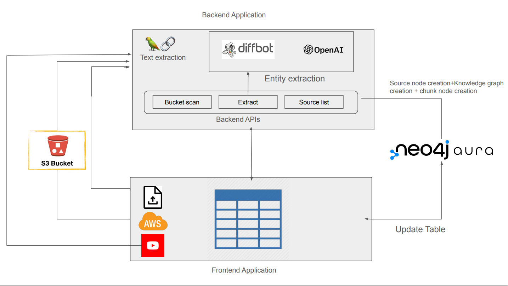

= LLM Knowledge Graph Builder

== Introduction

This document provides comprehensive documentation for the Neo4j llm-graph-builder Project, a Python web application built with the FastAPI framework. It covers various aspects of the project, including its features, architecture, usage, development, deployment, limitations and known issues.

== Features

* Upload unstructured data from multiple sources to generate structuted Neo4j knowledge graph.

* Extraction of nodes and relations from multiple LLMs(OpenAI GPT-3.5, OpenAI GPT-4, Gemini 1.0-Pro and Diffbot).

* View complete graph or only a particular element of graph(ex: Only chunks, only entities, document and entities, etc.) 

* Generate embedding of chunks created from unstructured content.

* Generate k-nearest neighbors graph for similar chunks.

* Chat with graph data using chat bot.

== Local Setup and Execution

Run Docker Compose to build and start all components:
....
docker-compose up --build
....

Alternatively, run specific directories separately:

** For frontend 
....
cd frontend
yarn
yarn run dev
....

** For backend
....
cd backend
python -m venv envName
source envName/bin/activate 
pip install -r requirements.txt
uvicorn score:app --reload
....

Set up environment variables 
....
OPENAI_API_KEY = ""
DIFFBOT_API_KEY = ""
NEO4J_URI = ""
NEO4J_USERNAME = ""
NEO4J_PASSWORD = ""
NEO4J_DATABASE = ""
AWS_ACCESS_KEY_ID =  ""
AWS_SECRET_ACCESS_KEY = ""
EMBEDDING_MODEL = ""
IS_EMBEDDING = "TRUE"
KNN_MIN_SCORE = ""
LANGCHAIN_API_KEY = ""
LANGCHAIN_PROJECT = ""
LANGCHAIN_TRACING_V2 = ""
LANGCHAIN_ENDPOINT = ""
NUMBER_OF_CHUNKS_TO_COMBINE = ""
....

== Architecture

== Development

==== Backend
link:backend/backend_docs.adoc[backend_docs.adoc]

==== Frontend
link:frontend/frontend_docs.adoc[frontend_docs.adoc]

== Deployment and Monitoring
* The application is deployed on Google Cloud Platform.

  To deploy frontend
....
gcloud run deploy 
source location current directory > Frontend
region : 32 [us-central 1]
Allow unauthenticated request : Yes
....

  To deploy backend
....
gcloud run deploy --set-env-vars "OPENAI_API_KEY = " --set-env-vars "DIFFBOT_API_KEY = " --set-env-vars "NEO4J_URI = " --set-env-vars "NEO4J_PASSWORD = " --set-env-vars "NEO4J_USERNAME = "
source location current directory > Backend
region : 32 [us-central 1]
Allow unauthenticated request : Yes
.... 

* Langserve is used with FAST API to deploy Langchain runnables and chains as a REST API.

* Langsmith is used to monitor and evaluate the application

Developement url 

Production url 

== Appendix

=== Limitations

** Only pdf file uploaded from device or uploaded from s3 bucket or gcs bucket can be processed.

** GCS buckets present under 1051503595507@cloudbuild.gserviceaccount.com service account can only be accessed.

** Only 1st page of Wikipedia content is processed to generate graphDocument.

=== Known issues 

** InactiveRpcError error with Gemini 1.0 Pro -  grpc_status:13, grpc_message:"Internal error encountered."

** ResourceExhausted error with Gemini 1.5 Pro - 429 Quota exceeded for aiplatform.googleapis.com/generate_content_requests_per_minute_per_project_per_base_model with base model: gemini-1.5-pro

** Gemini response validation errors even after making safety_settings parameters to BLOCK_NONE. 

